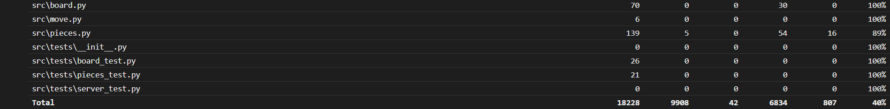
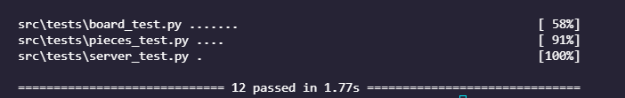

# Testing

## What has been tested and how
The project has been unit tested with the help of [unittest](https://docs.python.org/3/library/unittest.html) and [coverage](https://coverage.readthedocs.io/en/6.0.1/) testing frameworks.

## What types of input were used (especially important for comparative analysis)
There were used various types of input in order to modulate various game situations and the results were processed correspondingly. 

## How can the tests be repeated
The tests can be repeated by running `poetry run invoke test` command or by running `poetry run invoke coverage`/`poetry run invoke coverage-report` to see the output in a more presentable html format.

## Results of empirical testing presented in graphical form

