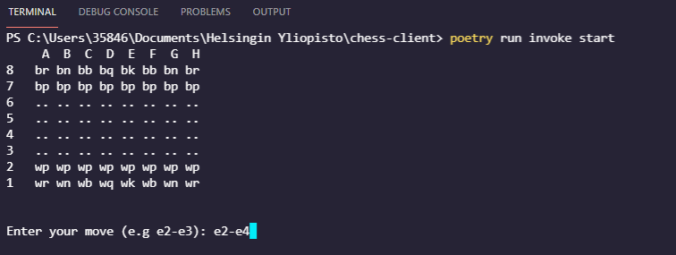

# User guide

## Execution

The program can be started using the command:

```bash
poetry run invoke start
```

## Input 

The game is playable via terminal. The program takes the current position of the piece that is to be moved and the destination location for it e.g. `a2-a3`.



